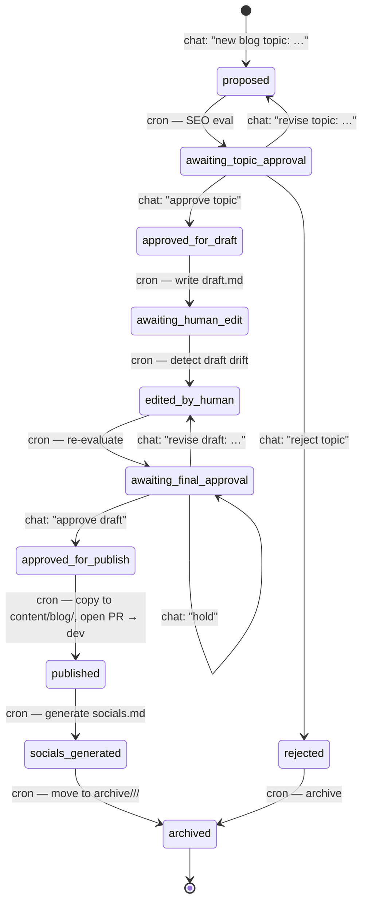

# BLOG-AUTOMATION.md - Dali House Agentic Blog Workflow

_Status: proposed MVP workflow with human-in-the-loop approval._

## Goal

Create a semi-automated blog pipeline for Dali House that can advance without Jadesse manually prompting every step.

Desired flow:
1. Jadesse proposes a blog topic
2. Agent evaluates SEO visibility and fit
3. Agent drafts the post
4. Jadesse edits the draft
5. Agent re-evaluates the edited draft
6. Jadesse approves the final version
7. Agent publishes the post
8. Agent promotes the approved post on the `blog-content` branch
9. Agent generates the related Instagram package automatically

## Recommendation

Use a **state-machine workflow** with:
- GitHub repo as the source of truth
- OpenClaw as the orchestrator
- cron for periodic progression checks
- explicit HITL checkpoints for topic approval and final publish approval

This is better than a fully autonomous system because:
- blog quality still needs human taste
- SEO scoring should inform decisions, not fully control them
- publishing should stay gated behind approval
- the repo gives you version control and audit history

## Best MVP architecture

### Source of truth
Use the real Dali House site repo as the system of record.

### Workflow queue
Create a repo folder such as:
- `content/pipeline/active/`
- `content/pipeline/archive/`

Only active posts should live in `content/pipeline/active/`.

Each active post gets its own folder:
- `content/pipeline/active/<slug>/brief.md`
- `content/pipeline/active/<slug>/status.json`
- `content/pipeline/active/<slug>/draft.md`
- `content/pipeline/active/<slug>/notes.md`
- `content/pipeline/active/<slug>/socials.md` (optional)

Use `notes.md` for SEO review notes, revision guidance, and final evaluation comments instead of splitting those into multiple review files.

Archive completed workflow artifacts only when needed:
- `content/pipeline/archive/<year>/<slug>/`

Final published blog file lives at:
- `content/blog/<slug>.md`

## Workflow states

Recommended states:
- `proposed`
- `evaluated`
- `awaiting_topic_approval`
- `approved_for_draft`
- `draft_created`
- `awaiting_human_edit`
- `edited_by_human`
- `re_evaluated`
- `awaiting_final_approval`
- `approved_for_publish`
- `published`
- `socials_generated`
- `rejected`

## Workflow diagram



Legend:
- **chat:** human action in the Dali Socials topic
- **cron:** automatic, runs on the next 15-min tick
- HITL gates (announced once, wait for chat): `awaiting_topic_approval`, `awaiting_final_approval`, plus any human edit pass on `awaiting_human_edit`

## Human-in-the-loop checkpoints

### HITL 1: Topic approval
After SEO review, the agent should pause and ask:
- proceed
- revise angle
- reject topic

### HITL 2: Final publish approval
After the edited draft is re-evaluated, the agent should pause and ask:
- publish
- revise again
- archive for later

## Trigger options

### Option A, recommended for MVP: chat-triggered + cron-managed
You send a message like:
- `new blog topic: Is coliving safer than random roommates for women moving to Dallas?`

The agent then:
- creates the pipeline folder in `content/pipeline/active/`
- writes the brief and initial SEO evaluation
- advances the workflow automatically via cron and repo state

### Option B: repo-driven
You create a `brief.md` or JSON file in `content/pipeline/active/`
The agent detects it on the next cron run and starts processing.

Option A is easier for you.

## Step-by-step workflow

### Step 1: Topic intake
Input fields:
- proposed topic
- target audience
- desired angle, optional
- urgency or publish target date, optional

Agent actions:
- generate slug
- map topic to a Dali House content pillar
- create `brief.md`
- set state to `proposed`

### Step 2: SEO viability evaluation
Agent actions:
- estimate keyword opportunity
- identify primary keyword and secondary keywords
- judge topic fit for Dali House audience
- recommend keep / narrow / reject
- write the evaluation into `notes.md`
- set state to `awaiting_topic_approval`

Output should include:
- search intent
- likely keyword difficulty
- business relevance
- recommended angle
- title suggestions
- verdict

### Step 3: Topic approval
Human action:
- approve
- request changes
- reject

Agent actions after approval:
- set state to `approved_for_draft`
- generate draft

### Step 4: Draft creation
Agent actions:
- write a full blog draft in brand voice
- include frontmatter
- include internal link suggestions
- include CTA
- write to `draft.md`
- set state to `awaiting_human_edit`
- **commit AND push to `origin/blog-content`** in the same tick so Jadesse can read/edit the draft on GitHub. A draft that is committed but not pushed is invisible — treat that as a bug.

### Step 5: Human edit
Human action:
- edit `draft.md` directly in GitHub, local repo, or another editor

Agent behavior:
- cron checks whether the draft changed since creation
- when a human edit is detected, set state to `edited_by_human`

### Step 6: Re-evaluation after edit
Agent actions:
- assess title, meta description, headings, keyword clarity, readability, and brand fit
- suggest only high-value fixes, not endless micro-edits
- append the re-evaluation into `notes.md`
- optionally patch the draft if allowed
- set state to `awaiting_final_approval`

### Step 7: Final approval
Human action:
- approve for publish
- request one more revision pass
- hold

### Step 8: Publish
Publish behavior:
- copy finalized draft to `content/blog/<slug>.md`
- commit the publish-ready content on `blog-content`
- **push to `origin/blog-content` immediately** — never leave the publish commit local-only
- keep active workflow artifacts minimal while the post is in progress
- open a PR from `blog-content` into **`dev`** — never `master`/`main`
- only merge to the production branch after explicit approval

My recommendation:
- all drafting and iteration lives on `blog-content`
- final publish creates or updates the canonical blog file on `blog-content`
- after publish, remove the post from `content/pipeline/active/` or move it into `content/pipeline/archive/<year>/<slug>/` only if you want the workflow history preserved
- then open a PR into `dev` for site integration

### Step 9: Social package generation
Immediately after publish, the agent should automatically generate:
- 1 Instagram carousel concept
- 1 caption
- 3 story frames
- optional reel idea

Those can be stored as:
- `content/pipeline/active/<slug>/socials.md`

If you want the same HITL structure for social content, add one more checkpoint:
- `awaiting_social_approval`

After the social package is generated, set state to:
- `socials_generated`

## Automation engine

## Recommended orchestrator
Use an OpenClaw cron job that runs every 10 to 15 minutes and:
- checks `content/pipeline/active/` for active items
- advances posts whose state can progress automatically
- pauses when a human approval is required
- announces only when action is needed or a milestone is complete

## Why cron instead of waiting for manual prompts
Because you said you do not want to prompt each step.
Cron gives you:
- automatic progression
- controlled pauses at approval gates
- less back-and-forth friction

## MVP delivery plan

### Phase 1: manual trigger, automated progression
Build first:
- active and archive structure
- status file format
- one cron job
- topic evaluation step
- draft step
- post-edit evaluation step
- publish step on `blog-content`
- automatic social package generation after publish

### Phase 2: richer social automation
Add:
- optional social approval gates
- Canva / Claude Design handoff format
- reusable visual brief generation

### Phase 3: richer GitHub workflow
Optional later:
- PR creation automatically
- label-based approvals
- issue-based queue
- changelog / reporting

## Suggested status.json shape

```json
{
  "slug": "moving-to-dallas-alone",
  "state": "awaiting_topic_approval",
  "topic": "Moving to Dallas alone as a woman",
  "primaryKeyword": "moving to dallas alone",
  "secondaryKeywords": ["relocating to dallas as a woman", "moving to dallas tips"],
  "assignedPillar": "Relocating to Dallas",
  "createdAt": "2026-04-24T00:00:00Z",
  "updatedAt": "2026-04-24T00:10:00Z",
  "needsHuman": true,
  "nextAction": "Approve, revise, or reject topic"
}
```

## Approval language

Keep approvals simple and explicit.

Suggested commands:
- `approve topic`
- `revise topic`
- `reject topic`
- `approve draft`
- `revise draft`
- `publish`
- `hold`

## Command cheat sheet — what to type to advance the next step

Send these in the Dali Socials topic. If only one post is active, the slug is optional.

| When you see this state | Type this | What happens on the next tick |
|---|---|---|
| `awaiting_topic_approval` | `approve topic` | Agent writes `draft.md`, pushes to `blog-content`, state → `awaiting_human_edit` |
| `awaiting_topic_approval` | `revise topic: <new angle>` | Re-runs SEO eval with your guidance, state → `awaiting_topic_approval` again |
| `awaiting_topic_approval` | `reject topic` | State → `rejected`, folder archived |
| `awaiting_human_edit` | _(edit `draft.md` on GitHub or locally and push)_ | Cron detects drift, state → `edited_by_human`, then auto-advances to `awaiting_final_approval` |
| `awaiting_final_approval` | `approve draft` | Copies to `content/blog/<slug>.md`, pushes, opens PR `blog-content` → `dev`, state → `published` |
| `awaiting_final_approval` | `revise draft: <guidance>` | Appends guidance to `notes.md`, state → `edited_by_human` |
| `awaiting_final_approval` | `hold` | Processor stops touching it until you send a new approval |
| _any state_ | `status` | Main agent reports current state, last action, and the path to the active folder |

Kicking off a new post:
```
new blog topic: <one-line topic>
audience: <optional>
angle: <optional>
```
Agent creates the pipeline folder and starts at `proposed`.

## Guardrails

- Do not auto-publish without explicit final approval
- Do not endlessly rewrite a draft after human edits unless asked
- Prefer one clean re-evaluation pass over infinite optimization
- Keep SEO in service of usefulness and brand fit
- Preserve Dali House tone: calm, warm, grounded, and practical

## My recommendation

Start with a narrow MVP:
- chat-triggered topic intake
- repo-based state files
- cron-driven progression
- drafts and workflow artifacts on `blog-content`
- final publish approval in chat
- automatic social package generation right after publish

That gets you 80 percent of the value without overbuilding.

## Next implementation step

If we build this, the next concrete task is:
1. add `content/pipeline/active/` and `content/pipeline/archive/` conventions to the real repo
2. create one sample post workflow
3. wire a cron-driven processor around those states
4. test the full loop on a single draft before scaling
