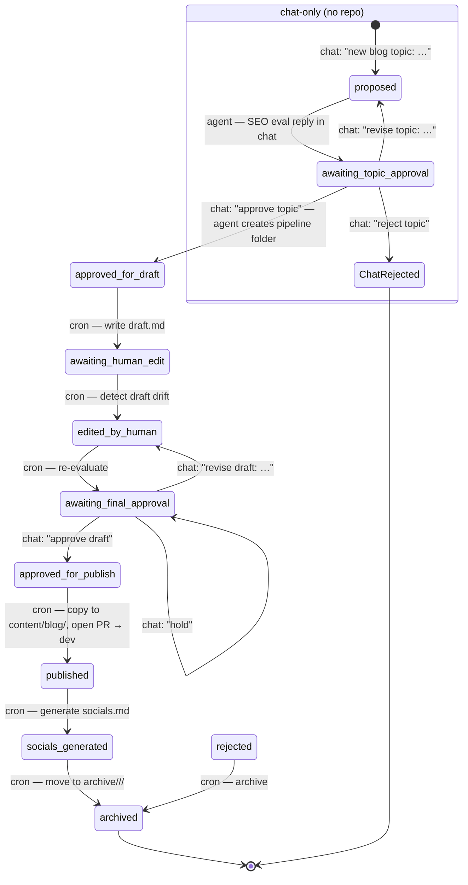

# Agentic Blog Workflow

## Goal

Create a semi-automated blog pipeline for Dali House that can advance without Jadesse manually prompting every step.

Desired flow:
1. Jadesse proposes a blog topic in chat
2. Agent evaluates SEO visibility and fit **in chat** — no repo touch yet
3. Agent drafts the post (only after the topic is approved in chat)
4. Jadesse edits the draft
5. Agent re-evaluates the edited draft
6. Jadesse approves the final version
7. Agent publishes the post
8. Agent promotes the approved post on the `blog-content` branch
9. Agent generates the related Instagram package automatically

## Where to chat with the workflow

Turn On:
`! openclaw cron enable e1d51878-6c7e-4a4c-b64a-9bf40b22bbe7`

Turn Off: 
`! openclaw cron disable e1d51878-6c7e-4a4c-b64a-9bf40b22bbe7`

All workflow commands (`new blog topic:`, `approve topic`, `revise topic`, `reject topic`, `approve draft`, `revise draft`, `publish`, `hold`, `status`) go in:

- **Telegram group:** Beet HQ
- **Topic:** Dali Socials (topic id `4`)

The cron processor announces HITL gates in the same topic, and the main agent only watches Dali Socials for workflow commands. Commands typed in other topics are ignored.

## Workflow states

Recommended states:
- `proposed`
- `evaluated`
- `awaiting_topic_approval`
- `approved_for_draft`
- `draft_created`
- `awaiting_human_edit`
- `edited_by_human`
- `re_evaluated`
- `awaiting_final_approval`
- `approved_for_publish`
- `published`
- `socials_generated`
- `rejected`

## Workflow diagram

The first three states (`proposed`, `evaluated`, `awaiting_topic_approval`) are **chat-only** — the main agent handles them as a conversation in Dali Socials. No repo work happens until `approve topic`. From `approved_for_draft` onward, every state is a folder in `content/pipeline/active/<slug>/` driven by the cron processor.



Legend:
- **chat:** human action in the Dali Socials topic
- **agent:** main agent reply in chat (no repo touch)
- **cron:** automatic, runs on the next 15-min tick
- HITL gates: `awaiting_topic_approval` (chat-only, agent reply waits for response), `awaiting_final_approval` (cron-announced, waits for chat), plus any human edit pass on `awaiting_human_edit`

## Example

### Step 1: Topic intake (chat-only, no repo)
Where: Dali Socials topic (id `4`).

Jadesse posts a message like:
```
new blog topic: <one-line topic>
audience: <optional>
angle: <optional>
```

Agent actions (still in chat, nothing committed):
- hold the proposed topic, audience, and angle in conversation memory
- generate a working slug
- map the topic to a Dali House content pillar
- proceed straight to Step 2 in the same reply

### Step 2: SEO viability evaluation (chat-only, no repo)
Where: Dali Socials topic (id `4`).

The agent must NOT touch the repo at this step. It replies to Jadesse in chat with a single evaluation message that includes:
- search intent
- primary keyword + 2–4 secondary keywords
- likely keyword difficulty
- business relevance for Dali House
- recommended angle
- 2–3 title suggestions
- verdict: keep / narrow / reject

End of message: an explicit prompt to advance — `Reply with "approve topic", "revise topic: <new angle>", or "reject topic".`

This whole step lives in chat memory only. If Jadesse never replies, nothing is left in the repo. If she replies `revise topic: …`, the agent re-runs Step 2 in chat with her guidance — still no repo touch.

### Step 3: Topic approval (chat → first repo write)
Where: Dali Socials topic (id `4`).

Human action: `approve topic` (or `revise topic: …` to loop back to Step 2, or `reject topic` to drop the proposal).

Agent actions ONLY upon `approve topic` — this is the first time the repo is touched for this post:
- create `content/pipeline/active/<slug>/`
- write `brief.md` (topic, audience, angle, slug, pillar)
- write `notes.md` (the Step 2 evaluation, verbatim)
- write `status.json` with state `approved_for_draft`
- commit on `blog-content`
- **push to `origin/blog-content`** in the same step
- reply in Dali Socials confirming the folder was created

The next 15-min cron tick picks up `approved_for_draft` and runs Step 4.

### Step 4: Draft creation
Agent actions:
- write a full blog draft in brand voice
- include frontmatter
- include internal link suggestions
- include CTA
- write to `draft.md`
- set state to `awaiting_human_edit`
- **commit AND push to `origin/blog-content`** in the same tick so Jadesse can read/edit the draft on GitHub. A draft that is committed but not pushed is invisible — treat that as a bug.

### Step 5: Human edit
Human action:
- edit `draft.md` directly in GitHub, local repo, or another editor

Agent behavior:
- cron checks whether the draft changed since creation
- when a human edit is detected, set state to `edited_by_human`

### Step 6: Re-evaluation after edit
Agent actions:
- assess title, meta description, headings, keyword clarity, readability, and brand fit
- suggest only high-value fixes, not endless micro-edits
- append the re-evaluation into `notes.md`
- optionally patch the draft if allowed
- set state to `awaiting_final_approval`

### Step 7: Final approval
Human action:
- approve for publish
- request one more revision pass
- hold

### Step 8: Publish
Publish behavior:
- copy finalized draft to `content/blog/<slug>.md`
- commit the publish-ready content on `blog-content`
- **push to `origin/blog-content` immediately** — never leave the publish commit local-only
- keep active workflow artifacts minimal while the post is in progress
- open a PR from `blog-content` into **`dev`** — never `master`/`main`
- only merge to the production branch after explicit approval

### Step 9: Social package generation
Immediately after publish, the agent should automatically generate:
- 1 Instagram carousel concept
- 1 caption
- 3 story frames
- optional reel idea

Those can be stored as:
- `content/pipeline/active/<slug>/socials.md`

If you want the same HITL structure for social content, add one more checkpoint:
- `awaiting_social_approval`

After the social package is generated, set state to:
- `socials_generated`

## Automation engine

## Recommended orchestrator
Use an OpenClaw cron job that runs every 10 to 15 minutes and:
- checks `content/pipeline/active/` for active items
- advances posts whose state can progress automatically
- pauses when a human approval is required
- announces only when action is needed or a milestone is complet

## MVP delivery plan

### Phase 1: manual trigger, automated progression
Build first:
- active and archive structure
- status file format
- one cron job
- topic evaluation step
- draft step
- post-edit evaluation step
- publish step on `blog-content`
- automatic social package generation after publish

### Phase 2: richer social automation
Add:
- optional social approval gates
- Canva / Claude Design handoff format
- reusable visual brief generation

### Phase 3: richer GitHub workflow
Optional later:
- PR creation automatically
- label-based approvals
- issue-based queue
- changelog / reporting

## Suggested status.json shape

```json
{
  "slug": "moving-to-dallas-alone",
  "state": "awaiting_topic_approval",
  "topic": "Moving to Dallas alone as a woman",
  "primaryKeyword": "moving to dallas alone",
  "secondaryKeywords": ["relocating to dallas as a woman", "moving to dallas tips"],
  "assignedPillar": "Relocating to Dallas",
  "createdAt": "2026-04-24T00:00:00Z",
  "updatedAt": "2026-04-24T00:10:00Z",
  "needsHuman": true,
  "nextAction": "Approve, revise, or reject topic"
}
```

## Approval language

Keep approvals simple and explicit.

Suggested commands:
- `approve topic`
- `revise topic`
- `reject topic`
- `approve draft`
- `revise draft`
- `publish`
- `hold`

## Command cheat sheet — what to type to advance the next step

**All commands go in: Beet HQ → Dali Socials topic (id `4`).** Anywhere else is ignored. If only one post is active, the slug is optional.

| Where you are | Type this | What happens |
|---|---|---|
| You haven't started a post yet | `new blog topic: <one-line topic>` (+ optional `audience:` / `angle:` lines) | Agent runs SEO eval **in chat** (no repo write) and asks you to approve, revise, or reject |
| Agent just posted SEO eval in chat | `approve topic` | Agent **creates** `content/pipeline/active/<slug>/` (brief.md, notes.md, status.json), commits + pushes to `blog-content`, state → `approved_for_draft`. Next cron tick writes `draft.md`. |
| Agent just posted SEO eval in chat | `revise topic: <new angle>` | Agent re-runs SEO eval in chat with your guidance — still no repo write |
| Agent just posted SEO eval in chat | `reject topic` | Agent drops the proposal in chat — nothing is committed |
| Repo state `awaiting_human_edit` | _(edit `draft.md` on GitHub or locally and push)_ | Cron detects drift, state → `edited_by_human`, then auto-advances to `awaiting_final_approval` |
| Cron announces `awaiting_final_approval` | `approve draft` | Copies to `content/blog/<slug>.md`, pushes, opens PR `blog-content` → `dev`, state → `published` |
| Cron announces `awaiting_final_approval` | `revise draft: <guidance>` | Appends guidance to `notes.md`, state → `edited_by_human` |
| Cron announces `awaiting_final_approval` | `hold` | Processor stops touching it until you send a new approval |
| _any time_ | `status` | Main agent reports current state, last action, and (if past topic approval) the path to the active folder |

## Guardrails

- Do not auto-publish without explicit final approval
- Do not endlessly rewrite a draft after human edits unless asked
- Prefer one clean re-evaluation pass over infinite optimization
- Keep SEO in service of usefulness and brand fit
- Preserve Dali House tone: calm, warm, grounded, and practical
